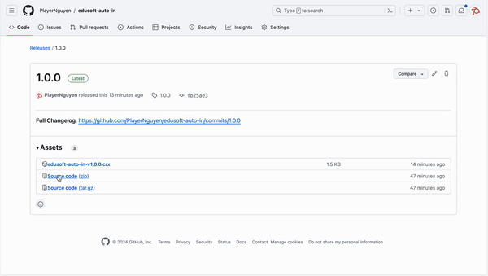
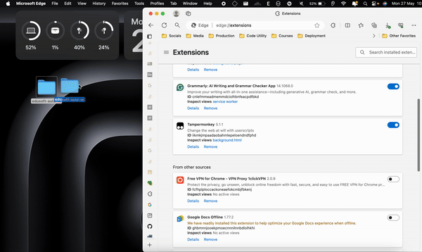

# Introduction

This chrome extension is a very lightweight script extension that **bypass** a captcha from the [Edusoft Website](https://edusoftweb.hcmiu.edu.vn/).

Since I am too lazy to input a captcha, so let's simplify this step before access the site :D.

# Installation

## Install via Github and Chrome Dev Environment

**1. Download a source code (.zip) file via [this link](https://github.com/PlayerNguyen/edusoft-auto-in/releases)**

**2. Extract the `.zip` file into a folder**
**3. Enable the Developer Mode on Chrome or Chromium Browser**

- On Edge, input `edge://extensions/` > at the left sidebar, switch **Developer Mode** to on
- On Chrome, input `chrome://extensions/` into an address bar > at the right corner, turn on **Developer Mode**
- I have not tested on other browser. However those are based on Chromium is perfectly operated.

**4. Go to `edge://extensions` > Drop extracted folder into Extensions tab**

The extension is completely installed. However, by using this solution, we cannot using auto update for checking a new version.

## Install via Chrome Web Store

**Coming soon**

_By the way, this solution took me 5 bucks to publish this extension onto a Chrome Web Store. I am very happy if this extension have any VIP person that supported me to publish this._

# License

This extension using MIT license. See [LICENSE.md](LICENSE.md)

# Contribution

Glad to see your contribution into this extension. If you have any result, create an issue ticket for the support.
